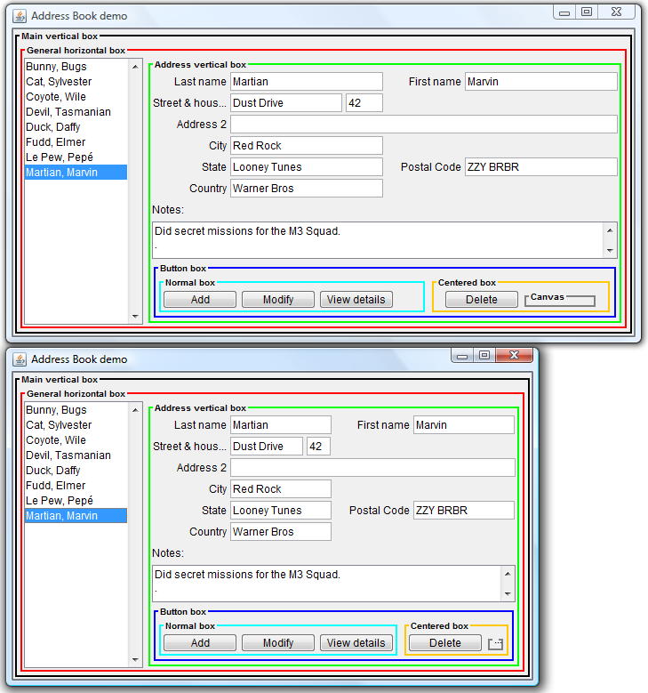
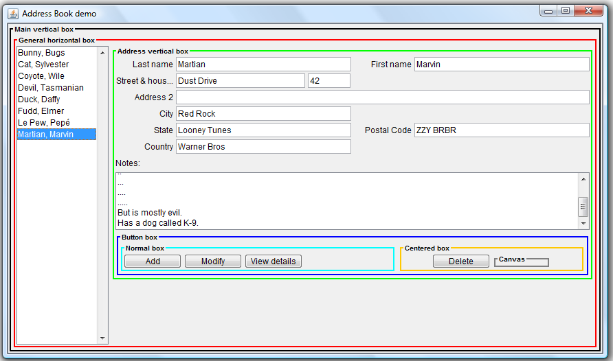
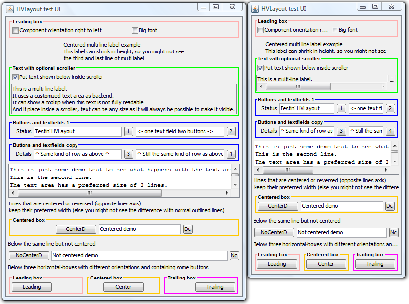
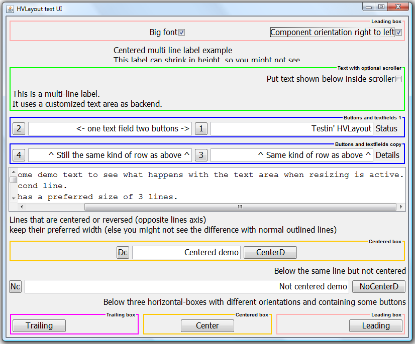
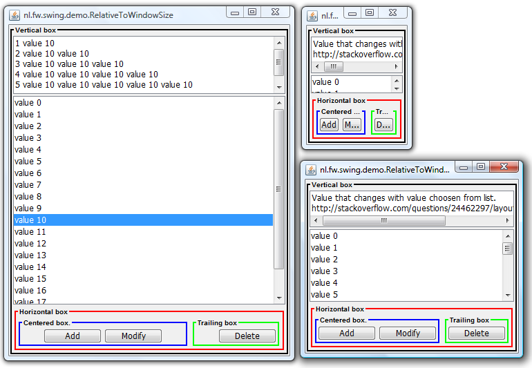

##### HVLayout manager for Java Swing

Windows should be resizable and window contents should adapt to user preferred font size. 
For many people displaying text with a large font is not an option but a requirement to read information on screen 
(e.g. the ``ctrl-plus`` function in an internet browser is a necessity).
It should be relatively easy to program a window showing a form with Java Swing that respects both requirements.
HVLayout can help you reach these goals.

***Using HVLayout***

Components displayed on screen can be aligned Horizontally and Vertically.
Horizontally aligned components are put in a HBox and vertically aligned components are put in a VBox.
An HBox can be put in a VBox and vice versa (nesting).

A component is initially displayed using it's preferred size and grows if it has a larger maximum size
and shrinks if it has a smaller minimum size. Growing and shrinking is always relative to how 
much other components in the same window want to grow and shrink.
 Default component sizes are stored in ``HVSize`` and to apply these sizes 
``CSize`` (which has a fluent API) can be used or extended.
For example, to create a button that does not grow or shrink:
 ``new CSize().set(new JButton("Example")).setFixedSize();``
 and done.
 ``CForm`` (also with a fluent API) is available to further assist in building and updating forms/content panes.

**Check it out**

HVlayout is the ``swing-hvlayout`` module of the multi-module Maven project in this repository,
but HVLayout has no dependencies and can be used separately from the other modules
(it could get it's own repository in the future).
To compile and build, checkout the complete repository and run ``mvn package``.
 The ``swing-demo`` project contains a couple of test and demonstration screens.
Have a look at the source code to see if HVLayout is something you can use
and run one of the demo-windows to see how HVLayout shrinks and grows components. 
 The ``swing-util`` project is irrelevant/under construction at the moment, but you may see something you like.
I'm refactoring code from my [old fwutil project](https://java.net/projects/fwutil/sources/svn/show/trunk/fwutil)
(where all this once started) in hope of building something useful (as time permits).

**Screenshots**

From the ``swing-demo`` project, some screenshots.
 The ``AddressBookDemo`` with prefererd size and minumum size:
 
 The ``AddressBookDemo`` with bigger window:
 
 The ``HvlayoutTestUI`` with prefererd size and minumum size:
 
 The ``HvlayoutTestUI`` with big font, right-to-left component orientation and bigger window:
 
 The ``RelativeToWindowSize`` with different sizes:
 
 

Unrelated: I'm also maintaining [Yapool](https://code.google.com/p/yapool/) (a Java generic object pool including a database connection pool).
